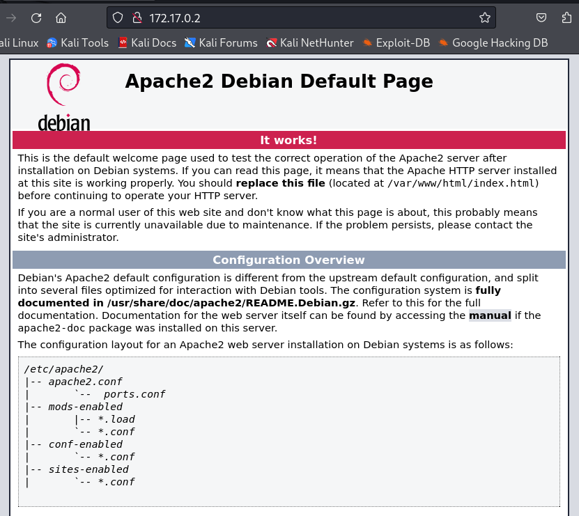
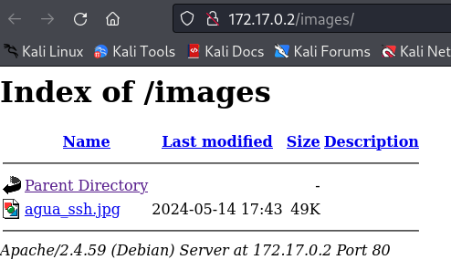

# DockerLabs: AguaDeMayo


### 1. Preparación del Laboratorio

* Descargamos el laboratorio de [DockerLabs](https://dockerlabs.es/)

* Descomprimir el archivo 

    ```bash 
    unzip aduademayo.zip
    ```
    * Descomprimimos el archivo ZIP para extraer la imagen de la máquina virtual necesaria para el laboratorio.

* Desplegamos la máquina virtual:

    ```bash 
    sudo bash auto_deploy.sh aguademayo.tar 

    # ========  Respuesta  ========
    Estamos desplegando la máquina vulnerable, espere un momento.
    Máquina desplegada, su dirección IP es --> 172.17.0.2
    Presiona Ctrl+C cuando termines con la máquina para eliminarla
    ```

    * Ejecutamos un script para desplegar la máquina virtual desde el archivo aguademayo.tar. Esto configura y arranca la máquina, y nos proporciona la IP para interactuar con ella.


### 2. Reconocimiento y Escaneo

* Verificamos la conectividad con `ping`:

    

    * Usamos ping para confirmar que la máquina está en línea. El `TTL` en la respuesta puede indicar el sistema operativo:
    * `TTL 64` es común en sistemas `Linux`.
    * `TTL 128` es típico en sistemas `Windows`


* Escaneamos los puertos con `nmap`:

    ```bash
    sudo nmap -p- --open -sS -sV --min-rate 5000 -vvv -n -Pn 172.17.0.2 -oX reportScan.xml
    ```

    

    * `nmap` se usa para identificar puertos abiertos y servicios en la máquina. Buscamos todos los puertos (-p-), solo los abiertos (--open), e intentamos identificar los servicios (-sV).

* **Resultado:**

    * Puertos Abiertos: 22 (SSH) y 80 (HTTP). El puerto HTTP se explora más a fondo porque SSH generalmente está protegido.

### 3. Exploración del Servidor Web

* Detectamos con la herramienta `WhatWeb` que tecnologías web estan utilizando.

    

    *  _El resultado muestra que está ejecutando Apache 2.4.59 sobre Debian, con la página predeterminada de Apache activa, lo que indica una configuración básica del servidor web._

* Accedemos a la `dirección IP ` en un navegador:

    

    * _Visualizamos la página web para buscar pistas o información útil_

* Inspeccionamos el código fuente de la página:

    

    * _Durante mi formación en ciberseguridad, aprendí la importancia de revisar el código fuente de las páginas web, como HTML y CSS, ya que en los CTFs es común encontrar información útil oculta allí. En este caso, encontré un comentario extraño en el código que no aportaba información clara. Normalmente, los comentarios deben guiar a otros desarrolladores sobre la funcionalidad del código, por lo que decidí investigar su significado._

### 4. Investigacion y Decodificación del Código `Brainfuck`
* Buscando en el navegador

    

    * _Los símbolos extraños que encontré son del lenguaje Brainfuck, un lenguaje de programación esotérico. En este lenguaje, cada símbolo representa una instrucción específica que manipula la memoria de manera directa._ 


* Identificamos y decodificamos el código en `Brainfuck`

    

    * _Después de decodificar el mensaje, obtuvimos bebeaguaqueessano. Esto podría ser una contraseña, considerando experiencias anteriores en CTFs o máquinas similares. Es posible que los nombres de usuario sean variantes como bebe, agua o sano. Sin embargo, para estar seguros, continuaremos con otros pasos para confirmar._

### 5. Enumeración de Directorios y Archivos

* Usamos `gobuster` para buscar directorios ocultos:.

    * _hay muchas herramientas yo utilizare `gobuster`, es una herramienta rápida y eficiente basada en Go, ideal para escaneos de directorios y archivos, y también para subdominios_.

    

* El resultado encontrado es:

    * _`/images:` Este es un directorio en el servidor web que ha sido encontrado y redirige a sí mismo. Podemos intentar acceder a `http://172.17.0.2/images/` en un navegador para ver qué contiene este directorio._

    * _`/server-status:` Este recurso también fue encontrado, pero el acceso está prohibido. Esto suele ser un recurso administrativo utilizado para mostrar el estado del servidor, y está protegido para que no sea accesible públicamente._

### 6. Análisis de la Imagen Encontrada
* Accediendo al la url `http://172.17.0.2/images/`

    

    * _Nos encontraMos una imagen `agua_ssh.jpg`, intentaremos ver sus metadatos haber que encontramos._

* Revisamos los `metadatos` de la imagen:

    
    


    * _En los metadatos no encontré información relevante, pero noté que la palabra `agua`se repite tanto en el código decodificado como en el nombre de la imagen. Esto me lleva a suponer que `agua`podría ser un posible nombre de usuario. Intentaré acceder mediante ssh usando `agua`como usuario, y si no funciona, probaré con los otros nombres mencionados anteriormente: `bebe` y `sano`._

### 7. Acceso SSH
* Intentamos iniciar sesión por SSH con posibles credenciales

    


    * _Primero intenté acceder con el usuario agua, ya que el nombre parecía estar relacionado con la información que obtuvimos de la imagen y el código decodificado. Si no hubiera funcionado, habría probado con otros nombres de usuario como `bebe` o `sano`. Afortunadamente, el acceso fue exitoso con `agua`, lo que confirma que esta pista era correcta. Es importante recordar que a veces las soluciones están más cerca de lo que pensamos; lo que parece obvio o repetitivo puede ser una clave crucial. Esta experiencia subraya la importancia de considerar todas las pistas disponibles y no descartar ninguna posibilidad, incluso si parece evidente._

### 8. Escalación de Privilegios
* Verificamos permisos con `sudo -l`:

    * _Una técnica básica para escalar privilegios en sistemas Linux es usar `sudo -l` para listar los comandos que el usuario actual puede ejecutar con permisos elevados. Sabíamos que era una máquina Linux por el TTL de 64 en los pings y porque WhatWeb identificó el sistema como Debian Linux._

    


    * _En los resultados, observamos que el usuario agua tiene permiso para ejecutar `/usr/bin/bettercap` como root sin necesidad de proporcionar una contraseña. Esto es una clara oportunidad para escalar privilegios._

* Probando `/usr/bin/bettercap`

    * _Bettercap es una herramienta de red que se utiliza para ataques y análisis de red._


    


    * Al hacer help para ver sus opciones nos muestra una parte `! COMMAND ` que significa ejecuta un comando de shell y muestra su salida.


    


    * _Hemos ejecutado `chmod u+s /bin/bash`, el bit `s` en chmod u+s es un permiso especial que permite ejecutar archivos con los permisos del propietario del archivo, lo cual es fundamental para técnicas de escalación de privilegios en seguridad informática.o_

    * _Cuando aplicamos `chmod u+s /bin/bash`, estás configurando el shell de Bash (/bin/bash) para que se ejecute con los permisos de su propietario, que normalmente es el usuario root._

    * _Esto significa que cualquier usuario que ejecute este archivo (/bin/bash) obtendrá una shell con los permisos del propietario (root), no importa con qué usuario hayan iniciado sesión._

* Salimos de `bettercap` y obtenemos una shell con permisos elevados:

    ```bash
    agua@72ac6d583e8f:~$  bash -p
    ```

* Verificamos el usuario actual con whoami:

    ```bash
    bash-5.2# whoami
    root
    bash-5.2# 

    ```

    * _Confirmamos que estamos operando como root, completando con éxito la escalación de privilegios._