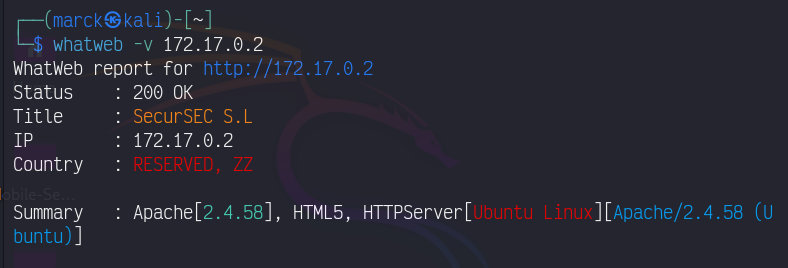

# DockerLabs: Amor


### 1. Preparación del Laboratorio

* Descargamos el laboratorio de [DockerLabs](https://dockerlabs.es/)

* Descomprimir el archivo 

    ```bash 
    unzip amor.zip
    ```
    * Descomprimimos el archivo ZIP para extraer la imagen de la máquina virtual necesaria para el laboratorio.

* Desplegamos la máquina virtual:

    ```bash 
    sudo bash auto_deploy.sh amor.tar 

    # ========  Respuesta  ========
    Máquina desplegada, su dirección IP es --> 172.17.0.2
    ```

### 2. Reconocimiento y Escaneo

* Verificamos la conectividad con `ping`:

    

    * Usamos ping para confirmar que la máquina está en línea. El `TTL` en la respuesta puede indicar el sistema operativo:
    * `TTL 64` es común en sistemas `Linux`.
    * `TTL 128` es típico en sistemas `Windows`


* Escaneamos los puertos con `nmap`:

   

    * Encontramos dos puertos Abiertos: 22 (SSH) y 80 (HTTP). El puerto HTTP exploraremos más a fondo porque SSH generalmente está protegido.

### 3. Exploración del Servidor Web

* Detectamos con la herramienta `WhatWeb` que tecnologías web estan utilizando.

    

    *  _La herramienta nos proporciona información sobre el software y las versiones que están operando en el servidor, como Apache y HTML5. Este análisis es crucial para identificar posibles vulnerabilidades asociadas con versiones específicas de estos componentes. Además, confirmamos que el servidor corre en un sistema operativo Linux, lo que nos orienta a aplicar técnicas de escalación de privilegios específicas para Linux._

* Accedemos a la `dirección IP ` en un navegador:

    

    * _Visualizamos la página web para buscar pistas o información útil, vemos que hay dos nombre `Juan` y `Carlota` que podrian ser usuarios._

    * _Despues de pensar y buscar mas cosas, hay algo en la pagina que dice que `Juan` es despedido y quedaria `carlota`, asi que `carlota` podria ser el usuario._

* Aplicacion de herramienta `Hydra` 

    

    * _Funciono!!! encontramos la contraseña asi que ahora podemos entrar a la maquina atraves de `ssh`._

* Ingresando a la maquina 

    
    

    * _Muy bien entramos a la maquina  ahora empezariamos a escalar privilegios, pero al hacer comandos como `sudo -l` y  `find / -perm -4000 -user root 2>/dev/null` no hay nada explotable._

    

    * _Probe con los otros usuarios que tenia pero las contraseñas son distintas, y probablemente por medio de uno de estos usuarios podremos escalar privilegios_

    

* Investigación de Directorios:


    

    * _Navegando los directorios, encontramos una imagen y aplicamos esteganografía para extraer datos cifrados_

    

* Analisis de la imagen

    
    

    * _una vez analizada la imagen, encontramos una informacion encriptada. Esto podria ser una contraseña de los otros usuarios._

* Desencriptar Información:

    

    * _Decodificamos la información de la imagen es una frase seguida que podria ser una contraseña, de alguno de los usuarios._

* Acceso con el usuario `oscar`

    

    * _la contraseña era de oscar, asi que ahora intentaremso escalar privilegiso por aqui_

* Escalar privilegios con usuario `oscar`

    

    * _Con la información proporcionada por el comando `sudo -l`, el usuario oscar tiene privilegios para ejecutar `/usr/bin/ruby` como cualquier usuario (ALL) sin necesidad de proporcionar una contraseña (NOPASSWD). Esta configuración nos puede permitir la escalación de privilegios.

* Consulta en`GTFOBins` para encontrar el binario:

    

    * _Consultamos GTFOBins para encontrar cómo usar ruby para escalar privilegios._

* Ejecucion del comando

    

    * _La escaalcion de privilegios salido con exito._

