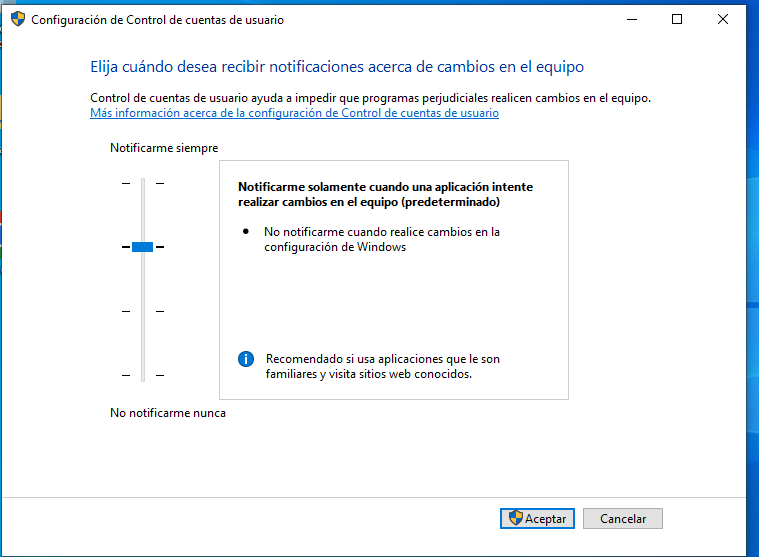
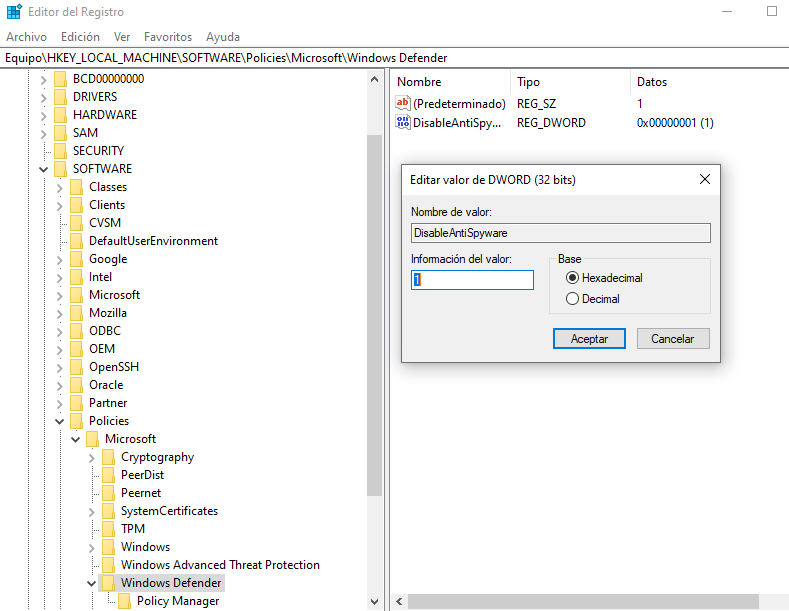
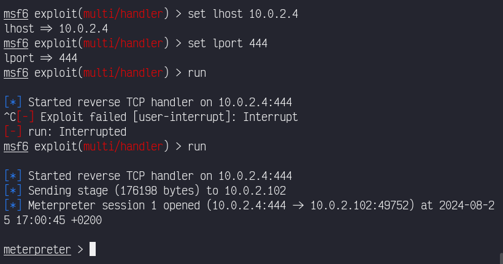
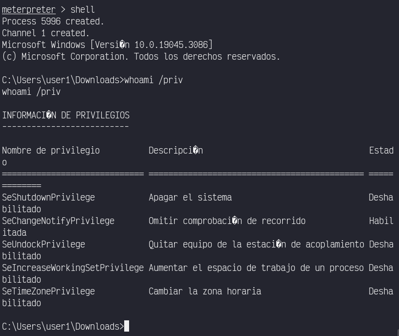
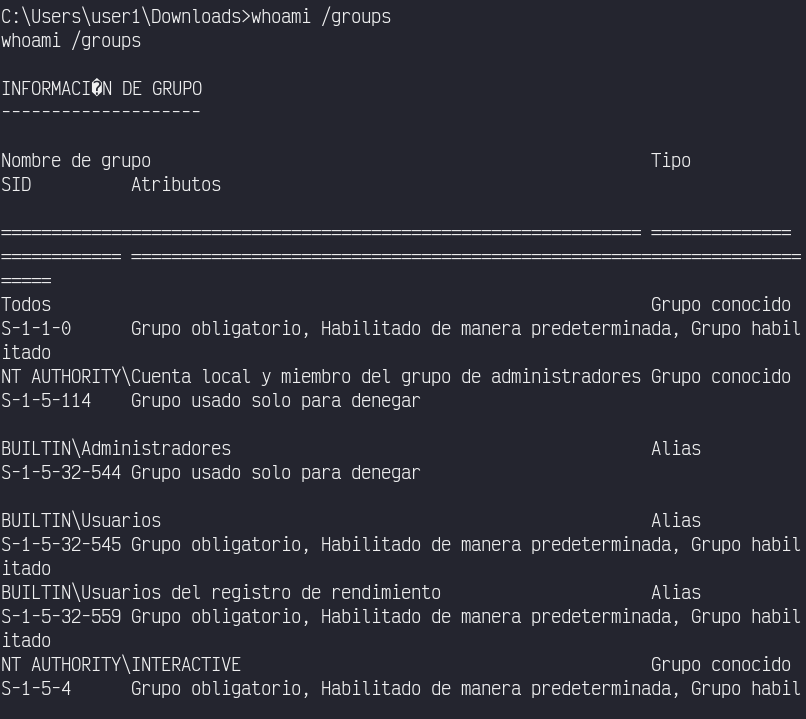

# EJERCICIOS EVASIÓN DE WINDOWS DEFENDER
## Prerrequisitos
* Kali Linux
* Windows 10 Evasion
## Ejercicio - Metasploit, Windows UAC y Windows Defender
* Entrar en el entorno gráfico de Windows 10 Evasion con el usuario user1, habilitar Windows UAC eligiendo nivel predeterminado y deshabilitar Windows
Defender.



deshabilitar windows defender https://aboutdevice.com/how-to-enable-or-disable-windows-defender/?authuser=1



* Crear un troyano y transferirlo al escritorio del usuario user1 en el sistema Windows 10 Evasion.


* Utilizar un exploit multi/handler para obtener un meterpreter reverso.


* En la sesión, abrir una shell y comprobar los permisos del usuario user1 y los grupos a los que pertenece para después corroborar si pertenece a algún grupo
con privilegios.



* Intentar elevar privilegios a NT Authority\System con comando de meterpreter. En caso de no funcionar la elevación con meterpreter utiliza algún módulo que
te permita elevar privilegios haciendo un bypass del Windows UAC.

```bash
meterpreter > run post/multi/recon/local_exploit_suggester 
```

* Crear un backdoor persistente y reiniciar el sistema Windows 10 Evasion para obtener una sesión que demuestre que funciona.

