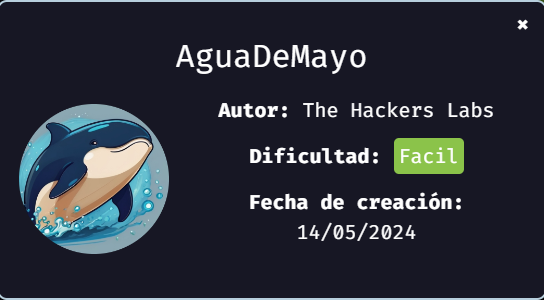

<!-- Cabecera HTML -->

    

        
    

    

        <a href="https://david-cics.onrender.com/" style="margin: 0 15px; text-decoration: none; color: white;">Home</a>
        <a href="https://david-cics.onrender.com/portfolio" style="margin: 0 15px; text-decoration: none; color: white;">Port</a>
        <a href="https://david-cics.onrender.com/about" style="margin: 0 15px; text-decoration: none; color: white;">About</a>
    

# Bienvenido a Mis Laboratorios

Aquí puedes encontrar una lista de mis laboratorios:

- [Laboratorio 1](/AguaDeMayo/Maquina_agua_de_mayo.md)
- [Laboratorio 2](/ing_social/ejericio2.md)
- [Laboratorio 3](laboratorio3.md)

    

        

        <a href="https://marckweb.github.io/writeUps/AguaDeMayo/Maquina_agua_de_mayo.html" style="margin: 0 15px; text-decoration: none; color: white;">
        
        DockerLabs:AguaDeMayo
        </a>
        

    

    

        

        <a href="https://marckweb.github.io/writeUps/AguaDeMayo/Maquina_agua_de_mayo.html" style="margin: 0 15px; text-decoration: none; color: white;">
        
        DockerLabs:AguaDeMayo
        </a>
        

    

